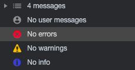
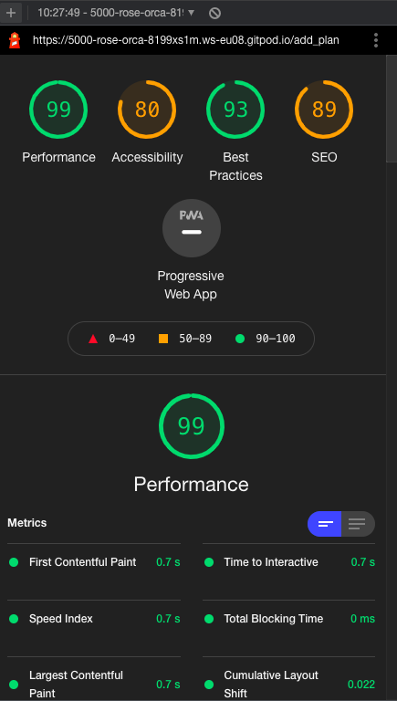

<a href="https://daily-planner101.herokuapp.com" target="_blank"></a>
# Daily Planner
### Third Milestone Project 

<p><strong>Daily Planner </strong> is a personal web application for those who loves to organize their daily plan, 
where users can register, log-in, create, read, update, delete and search created their plan</p>

<p>Inspired by my boyfriend who's very old school and who still write down his plan with the use of paper and pen. I find it difficult for me to 
see him still using the old fashioned way so I have decided to create an app with a simple, clean and user friendly design. 
For his love of the ocean, coffee, and croissant, I have used the said images to brighten up his day and every user and I guess everybody loves them too.</p>

[View the live project here](https://daily-planner101.herokuapp.com)
<hr>

### Table of contents
1. UX
     1. Project Goals
     2. User Stories
     3. Development Planes
2. Data Schema
     1. Categories Collection
     2. Task Collection
     3. Users Collection
3. Features to Implement in the future
4. Issues and Bugs
5. Technologies used
     1. Languages
     2. Tools
     3. Libraries
     4. Database Management
6. Testing
7. Deployment
     1. Database Creation
     2. Local Copy Creation
     3. Heroku App Creation
8. Credits
9. Acknowledgements
10. Technical Support
***

# UX 
## Project Goals
The primary goal of **Daily Planner 101** is to provide a web-based application, that is simplistic and user friendly design, 
that allows users to **create**, **read**, **update**, **delete**, and **search** their plan in one app.

This is the third of Milestone Project that the developer student must complete during their Full Stack Web Development 
Program at The Code Institute and the main requirements is to build a full-stack website allowing users to manage a common dataset using 
**HTML5**, **CSS3**, **JavaScript**, **Python**, **Flask** and **MongoDB**.

#### User Goals
The user is looking for:
- A searchable database.
- Create a user account.
- An easy-to-use dataset management system with **CRUD** conventions to:

    - Create plan.
    - Read plan.
    - Update the plan.
    - Delete created plan.


#### Developer / Site Owner Goals
The Developer is looking to:

- Create a user-friendly application that they themselves would use for organizing their daily tasks .
- Demonstrate their proficiency in a variety of software development skills, using newly learned languages and libraries as well as a document database system.
- Deploy a project they are proud of, and excited to have, on their portfolio.


## User Stories
**As a General User, I want to:**

1. Create, Read, Update, Delete daily plan and find them on the database. 
2. View the selected plan dashboard to get necessary information.
3. Provide links to stay connected with the developer or an app made.

**As a Non-Registered User, I want to:**

1. Navigate to Sign-Up page to Register an account.

**As a Registered User, I want to:**

1. Log into my account to access to the full functionality of the planner.
2. Navigate to my planner page to view tasks.
3. Create a task .
4. View my plans to edit task as needed.
5. View my plans to delete task.


**As an Admin, I want to:**

1. View Manage Plan button and should be to visible to admin.
2. Add categories, Edit and Delete them.


## Development Planes

***1. Strategy Plane*** 

The web app is being developed to be used as daily basis specially for organized. 
It is suitable for all gender and for all ages. It broken into three categories which focused on the following target audiences:
- **Roles:**
     - New Users (Non-Registered)
     - Returning Users (Registered)
     - Admin (Site Management)

The website needs to enable the user to:
- Register/Login to an account
- Create plan
- Search Plan created in the database 
- View created Plan with the following information:
    - Plan Category
    - Plan 
    - Plan Description
    - Plan Date
    - Time
    - Created by:

- Save and access their created plan
- Stay connected with the app through social links
- Button to go back to top
- Testimonials for user feedback


***2. Scope Plane*** 

A scope was defined to identify what needed to be done in order to align features with the strategy previously defined. This was broken into two categories:
- **Content Requirements**
     - The user will be looking for:
        - Creating an account:
            - Custom Username/Password
            - Create their own Plan
            - Manage their own Plan
        - Easy Navigation
        - Aesthetic and identifiable theme
        - My Plan dashboard
        - Searchable database system
        - Site Social links

- **Functionality Requirements**
     - The user will be able to:
        - Register/Login to account
        - Create their profile:
            - Customise Username/Password
            - Edit and Delete their account
            - Create their own Plan
            - Edit and delete their Plan
            - Save Plan
        - Navigate to their plan:
            - Search engine
            - My Plan Page
        - Create their plan, providing:
            - Plan Category
            - Plan 
            - Plan Description
            - Plan Date
            - Time
            - Created by:
        - Stay connected with site
            - Social links

***3. Structure Plane*** 

The information architecture was organized in order to ensure that users could navigate through the site with ease and
efficiency, with the following features: 

Each page of the website features a responsive and intuitive navigational system:
- There is a conventionally placed **navbar** on the top of each page with easily accessible navigation links with a clickable logo, redirecting users back to the home page.
    - On mobile and tablet screens, the navbar is located in a conventionally placed 'hamburger' menu.
- Landing Page Navbar includes:
    - Home
    - Log in
    - Register
- Upon Logging in Navbar includes: 
    - Home
    - My Plan
    - Add Plan
    - Log out
- If the admin is in session, there will be additional link added to the `navbar`:
     - Manage Plan
- On mobile and tablet screens, the extra buttons will appear on the navigation (hamburger) menu in order to provide quick access.
- There is a **banner image with quotes** on landing page.
- There is an **image** at the  bottom of the banner image to create eyecatching landing page.
- Testimonials of the user on the landing page.
- The **Footer** contains the appropriate **icons** to allow users to:
    - Link to the Facebook Page.
    - Link to the Instagram Page.
    - Link to the Pinterest Page.
    - Link to the Yoututbe Page.
- Copyrights on th footer.   
- Go to top button.
- tool tipped
- [Jinja](https://pypi.org/project/Jinja2/) was used to extend the `base.html` page, allowing for the utmost consistency and preservation of functionality across all pages. 
    The extended block elements created basic layout for each page. Sample:

     ```
    
    Members

    
    
        <ul>
        
        <li><a href="{{ user.url }}">{{ user.username }}</a></li>
        
        </ul>

    

     ``` 
**[Home Page](https://daily-planner101.herokuapp.com/)**
| Feature      | Description  |
|--------------|--------------|
| Carousel     | Bootstrap Carousel Component that displays the l**ast four uploaded** recipes |
| Call to Action | Buttons connecting users to Register or Login page. |

**[Log in Page](https://daily-planner101.herokuapp.com/login)**
| Feature       | Description  |
|---------------|--------------|
| Input Fields    | The input fields allow users to enter their information. |
| Password Authentication | The **password** field uses [Werkzeug](https://werkzeug.palletsprojects.com/en/2.0.x/) to hash the password on entry and confirm password is validated. |
| Call to Action | Once the input fields are completed as required, the user can click to Register or, if they already have an account, they can Login. |

**[Register Page](https://daily-planner101.herokuapp.com/register)**
| Feature       | Description  |
|---------------|--------------|
| Input Fields    | The input fields allow users to enter their username. |
| Password Authentication | The password field uses [Werkzeug](https://werkzeug.palletsprojects.com/en/2.0.x/) to un-hash the password for login authentication|
| Call to Action | Once the input fields are completed as required, the user can click to Login or, if they do not already have an account, they can Register. |

**My Plan Page** (This page requires login authentication)
| Feature       | Description  |
|---------------|--------------|
| Search bar | The user will be able to search their created Plan and it has done and reset button. |
| Call to Action    | The User's Plan provides multiple actions where the user can edit existing plan, It has done and edit button. |

**Manage Plan Page** (This page requires login authentication)
| Feature       | Description  |
|---------------|--------------|
| Add Categogry button | For admin to add and edit Categories|
| Categories Card | Existing Categotries with Edit and Delete button |

***4. Skeleton Plane*** 

Wireframe mockups were created in a [Balsamiq Cloud](https://balsamiq.cloud/sw8ybdy/pnztp2i/r2278) with providing a positive user experience in mind:


***5. Surface Plane*** 

- <strong>Colour Scheme</strong>

     - The chosen colour scheme was specifically selected in order to define the tone of the application.

     - A colour palette was developed to create an ambient and familiar environment throughout the site.

     - "COLOORS" is being used for [Color Generator](https://coolors.co/).

     - The selected colours are:

          

     - Additional colors are simply green and red for the highlight buttons like "Done and Urgent buttons". 


- <strong>Typography</strong>

     - The primary font chosen is [Roboto](https://fonts.google.com/specimen/Roboto#standard-styles). Roboto has a dual nature. 
     It has a mechanical skeleton and the forms are largely geometric. At the same time, the font features friendly and open curves. 
     While some grotesks distort their letterforms to force a rigid rhythm, Roboto doesn’t compromise, allowing letters to be settled 
     into their natural width. This makes for a more natural reading rhythm more commonly found in humanist and serif types. 
     This is the stardard font type of "Materialize". I also made sure that it wont complicate throughout application.

- <strong>Imagery</strong>

     - The imagery chosen are from [Unsplash](https://unsplash.com/) in order to create a consistency of the app while maintaining the 
     look and feel of the application. 
     - I have used [Cloudinary](https://cloudinary.com/) and apply it to connect with the images used. I have input text as well on the 
     banner image in which the app would love to emphasize and the purpose of it is to motivate the user as well.
        -  by Amy Humphries
        -  by Cathryn Lavery

[Back to top ⇧]()

## Data Schema

For this project, the NoSQL database [MongoDB](https://www.mongodb.com/) was used to store the dataset. 
Within the created database, three collections were created, as illustrated below:


### Categories Collection

- There are three specified categories that the developer made for the user to chose from depending on 
the different times of the day:
    - Morning
    - Afternoon
    - Evening

### Tasks Collection
- When creating a recipe, the user provides:
    - Plan 
    - Plan Description
    - Plan Date
    - Time
    - Created by:

### Users Collection
- When registering an account, the user provides:
     - Username (unique identifier)
     - Password (hashed)

## Features to Implement in the future

- Pagination
- Google login 
- Lazy loading images 
- "Remember me" signup checkbox
- Edit user profiles
- User profiles Avatar 
- Page loading animation
- Third party search engine
- Admin console
- More categories
- Sort tasks by date
- Testimonial functionality
- Email verification
- Error flash messages 

[Back to top ⇧](#table-of-contents)


## Issues and Bugs 
I have encountered a number of issues during the development of the website, with the noteworthy ones listed below, along with solutions:

- Manage plan in the Navbar should be visible to admin only
    - I have created a "created by" in the database and added this "tasks = mongo.db.tasks.find({"created_by": session["user"]})" in the 
    get_tasks app.py file.

- Visibility of Navbar for registered and non registered    
    - I have created jinja loop.

- Minor errors like alignment of the elements that leads to bugs.    
    - Manually fixed them.

- Plan date to be shown only from the current date.
    - Added this in script.js "minDate: new Date(),"

- Positioning of the Testimonials, The bug caused by the materialize.
    - Manually edited with CSS.

- Heroku Deployment wasn't working due to wrong code in the procfile - "web: app.py"
    - I have add "python" to debug result - "web: python app.py"    

- Lack of time to add more features and functionality since I am starting my MS4 Project at the same time.

- Lack of time to do more test since I am starting my MS4 Project at the same time.

- Theia folder is in the project because I have used the gitpod full template provided by the code institute.
I am worried that i might cause a bug once I deleted it so i let it there.


[Back to top ⇧](#table-of-contents)

## Technologies Used
### Languages
- [HTML5](https://en.wikipedia.org/wiki/HTML5 "Link to HTML Wiki")
- [CSS3](https://en.wikipedia.org/wiki/Cascading_Style_Sheets "Link to CSS Wiki")
- [JavaScript](https://en.wikipedia.org/wiki/JavaScript "Link to JavaScript Wiki")
- [Python](https://www.python.org/ "Link to Python Homepage")

### Tools
- [Git](https://git-scm.com/ "Link to Git homepage")
     - Git was used for version control to commit to Git and push to Heroku.
- [GitHub](https://github.com/ "Link to GitHub")
     - GitHub was used to store the project repository, after pushing.
- [Heroku](https://id.heroku.com/login "Link to Heroku login page")
     -  Heroku was used in order to deploy the website.
- [Balsamiq](https://balsamiq.com/" Link to Balsamiq homepage")
     - Figma was used to create the wireframes during the design phase of the project.
- [Am I Responsive?](http://ami.responsivedesign.is/# "Link to Am I Responsive Homepage")
     - Am I Responsive was used in order to validate the responsiveness of the design, and to generate mockup imagery to be used.
- [COLOORS](https://coolors.co/ "Link to COLOORS homepage")
     - COLOORS is a  colour picker tool and created image out of it.
- [Unsplash](https://unsplash.com/ "LINK TO COLOORS") 
     - Unsplash was used for images.
- [Cloudinary](https://cloudinary.com/ "Link to Cloudinary site")
     - Cloudinary is being used to access the image through cloud and edited the images as well using it.
- [Font Awesome](https://fontawesome.com/ "Link to Font Awesome site")
     - Font Awesome was used in conjunction with Iconify for icons used throughout the website.


### Libraries

- [Materialize](https://materializecss.com/ "Link to Materialize site")
     - Materialize is used for a responsive front-end framework
- [jQuery](https://jquery.com/ "Link to jQuery page")
     - jQuery was used to simplify the JavaScript code used.
- [Flask](https://flask.palletsprojects.com/en/2.0.x/ "Link to Flask Homepage")
     - Flask was used as the web framework for the application.
- [PyMongo](https://pypi.org/project/pymongo/ "Link to PyMongo information")
     - `flask_pymongo` was used a communication line between the MongoDB database and Python.
- [BSON](https://bsonspec.org/ "Link to BSon documentation")
     - `bson.objectid` is a required dependency for MongoDB management system.
- [Jinja](http://jinja.pocoo.org/docs/2.10/ "Link to Jinja information")
     - Jinja templating language was used to simplify and display backend data in html.
- [Werkzeug](https://werkzeug.palletsprojects.com/en/2.0.x/ "Link to Werkzeug information")
     - Werkzeug was used for password hashing and authentication.

### Database Management
- [MongoDB](https://www.mongodb.com/ "Link to MongoDB site")
     - MongoDB was the chosen NoSQL database for this website.
- [MongoDB Atlas](https://www.mongodb.com/cloud/atlas "Link to MongoDB Atlas site")
     - MongoDB Atlas was the cloud database service used to host the database.


[Back to top ⇧](#table-of-contents)

## Testing

I did most of the testing manually since I am still learning how to test efficiently. Below are the test that I've made:

- Though Chrome Devtools I made sure that  in the console doesn't show any errors in every page.


- I have used Lighthouse to test the performance.


- HTML and CSS validator, It went well except the jinja is complicating the testing.

- The Mobile and Web responsiveness has been tested using Chrome devtools and I am  responsive for the images aswell.


- Werkzeug is being used as an interactive debugger that allows inspecting stack traces and source code in the browser with an interactive interpreter for any frame in the stack.

- Manual testing of Logo and ensure will redirected to homepage.

- Manual testing of landing page and ensure that the Home, Login, Register navbar button only will be shown for not registered users.

- Manual testing of log in page and ensure that once logged in, the Home, My Plan, Add Plan and Log out button will be shown.

- Manual testing of Register page and ensure that once registered , the Home, My Plan, Add Plan and Log out button will be shown.

- Manual testing of Admin page and ensure that once logged in, the Home, My Plan, Manage Plan, Add Plan and Log out button will be shown.

- Manual testing of My Plan page and ensure that once clicked, the Plans created will be listed and there will be a button where u can edit, done or reset the plan.

- Manual testing of Search bar and ensure will find the created plans of the user in the database.

- Manual testing of Add Plan page and ensure that once clicked, A form will be shown where u can add the following:
    - Plan Category (to be chosen)
    - Plan 
    - Plan Description
    - Plan Date
    - Time
    - Created by:
        - Add Plan button is in the same page that will redirect the user to "My plan" once a new Plan has been created.

- Manual testing of Log out Navbar and ensure that the session will be deleted and will redirect the user to the login page.     

- Manual testing of the hamburgerbutton once its in the mobile  or ipad viewand ensure that it will be redirected to their exact navbar links.

- Manual testing of the tool tipped and ensure that it will function once it clicked.

- Manual testing of the social links in the footer section and ensure that it will be redirected to their exact social pages.

   - further testing will be made in the future once I am knowledgeable enough of other testing method.

## Deployment
To further develop this project, a clone can be made using the following steps:
### 1. Database Creation
The application is connected to a [MongoDB Atlas](https://mongodb.com/ "Link to MongoDB Homeapage") Cluster. A Project database can be created using the following steps:

1. Log into [MongoDB](https://account.mongodb.com/account/login "Link to MongoDB login page") or [create an account](https://account.mongodb.com/account/register "Link to MongoDB sign-up page").
2. Locate and select the `New Project` button on the right side of the page, and give your project a name. Navigate to the project page.
3. Locate and select the `Create a New Cluster` button on the right side of the page. Once selected:
     - Choose **Shared Cluster** which is a free option.
     - Select your **Cloud Provider** and **Region** (in this instance: **AWS** and **Ireland**).
     - Click on **Cluster Tier** and select tier of preference (in this instance: **Basic M0 tier**).
     - Click on **Cluster Name** and create your cluster name.
4. Locate and select `Database Access` on the left side of the page. Once selected, click `Add New Database User`:
     - Choose `Password` for the **Authentication Method**
     - Enter a username and password of your choosing
     - Ensure `Read and write to any database` is selected in **Database User Privileges**
     - Add User
5. Locate and select `Network Access` under `Database Access` on the left side of the page. Once selected, click `Add IP Address`:
     - Select `Allow Access from anywhere` (This is not recommended for full-production applications).
     - Select `Confirm`.
6. Locate and select `Clusters` on the left side of the page (must be provisioned first).
7. Click `Collections`, then `+ Create Database` to start adding documents to your database collections:
     - Enter chosen `Database Name`
     - Enter chosen `Collection Name`
     - Select `Create`
8. Click `Create Collection` and create the necessary collections. See [Data Schema](#Data-Schema) for reference of the collections created for this project.

### 2. Local Copy Creation
A Local Clone of the repository can be made in two ways:

- **Forking the Repository:**

     By forking the GitHub Repository we make a copy of the original repository on our GitHub account to view and/or make changes without affecting the original repository by using the following steps:

     1. Log into [GitHub](https://github.com/login "Link to GitHub login page") or [create an account](https://github.com/join "Link to GitHub create account page").
     2. Locate the [GitHub Repository](https://github.com/rebeccatraceyt/bake-it-til-you-make-it "Link to GitHub Repo").
     3. At the top of the repository, on the right side of the page, select "Fork".
     4. You should now have a copy of the original repository in your GitHub account.

-  **Creating a Clone**

     How to run this project locally:
     1. Install the [GitPod Browser](https://www.gitpod.io/docs/browser-extension/ "Link to Gitpod Browser extension download") Extension for Chrome.
     2. After installation, restart the browser.
     3. Log into [GitHub](https://github.com/login "Link to GitHub login page") or [create an account](https://github.com/join "Link to GitHub create account page").
     2. Locate the [GitHub Repository](https://github.com/rebeccatraceyt/bake-it-til-you-make-it "Link to GitHub Repo").
     5. Click the green "GitPod" button in the top right corner of the repository.
     This will trigger a new gitPod workspace to be created from the code in github where you can work locally.

     How to run this project within a local IDE, such as VSCode:

     1. Log into [GitHub](https://github.com/login "Link to GitHub login page") or [create an account](https://github.com/join "Link to GitHub create account page").
     2. Locate the [GitHub Repository](https://github.com/rebeccatraceyt/bake-it-til-you-make-it "Link to GitHub Repo").
     3. Under the repository name, click "Clone or download".
     4. In the Clone with HTTPs section, copy the clone URL for the repository.
     5. In your local IDE open the terminal.
     6. Change the current working directory to the location where you want the cloned directory to be made.
     7. Type 'git clone', and then paste the URL you copied in Step 3.
     ```
     git clone https://github.com/USERNAME/REPOSITORY
     ```
     8. Press Enter. Your local clone will be created.

     (Further reading and troubleshooting on cloning a repository from GitHub [here](https://docs.github.com/en/free-pro-team@latest/github/creating-cloning-and-archiving-repositories/cloning-a-repository "Link to GitHub troubleshooting"))

Once a local clone is created, the environment variables have to be set:

1. Create a `.gitignore` file in the project's root directory.
2. In the terminal window, type `touch env.py` to create the file that will contain the environment variables. 
3. Add `env.py` to the `.gitignore` file.
4. Within the `env.py` file, enter the project's environment variables:
```
import os

os.environ.setdefault("IP", "0.0.0.0")
os.environ.setdefault("PORT", "5000")
os.environ.setdefault("SECRET_KEY", <your_secret_key>)
os.environ.setdefault("MONGO_URI", "mongodb+srv://<username>:<password>@<cluster_name>-ocous.mongodb.net/<database_name>?retryWrites=true&w=majority" )
os.environ.setdefault("MONGO_DBNAME", <your_mongo_db_name>)
```
For the `MONGO_URI` ensure to replace `<username>`, `<password>`, `<cluster_name>` and `<database_name>` with the appropriate alternatives.


### 3. Heroku App Creation
The website requires back-end technology, including a server, application and database. It is because of this that the project was deployed on **Heroku**, a container-based cloud Platform as a Service. There are two ways to deploy on Heroku:

- Using the Heroku Command Line Interface
- Connect to GitHub Repository (the developer recommends this method)

Before deployment can be carried out on Heroku, the following steps must be carried out:

1. Create a `requirements.txt` file to install all requirements. In the terminal window, type the following command:
```
pip3 install -r requirements.txt
```
2. Create a `Procfile` file so that Heroku knows which file runs the app. In the terminal window, type the following command:
```
echo web: python app.py > Procfile
```
*Remove the blank line that may occur at the end of the Procfile to avoid any issues*


3. Push the two files to the repository:
```
git add requirements.txt
git commit -m "Add requirements.txt"

git add Procfile 
git commit -m "Add Procfile"

git push
```
Once these steps are completed, continue with the process:

1. Log into [Heroku](https://id.heroku.com/login "Link to Heroku login page") or [create an account](https://signup.heroku.com/login "Link to Heroku sign-up page").
2. Select the `New` button on the top-right of the page, and choose `Create New App`. Give your app a unique name and set the region (in this instance: **Europe**). Then click `Create App`.
3. Navigate to the `Deploy` tab on the dashboard and select `Connect to GitHub`.
4. Search for the repository name (ensuring it is spelled correctly). Once located, click `Connect`. 
5. Navigate to the `Setting` tab on the dashboard and select `Reveal Config Vars`, entering the necessary key/values as below:

| Key | Value |
 --- | ---
IP | 0.0.0.0
PORT | 5000
SECRET_KEY | `<your_secret_key>`
MONGO_URI | `mongodb+srv://<username>:<password>@<cluster_name>-ocous.mongodb.net/<database_name>?retryWrites=true&w=majority`
MONGO_DBNAME | `<your_mongo_db_name>`

6. Navigate back to the `Deploy` tab and scroll down to `Automatic Deploys`.
7. Ensure that the `master` branch is selected, then select `Enable Automatic Deploys`.

Heroku will receive the pushed code from the GitHub repository and host the application with the required packages set out. 

The deployed version can now be viewed by selecting `View App` in the top-right of the page.


[Back to top ⇧](#table-of-contents)

## Credits 

I have consulted multiple sites in order to better understand the code I needed to implement the deisgn. 

The [Code Institute Task Manager Mini Project](https://github.com/Code-Institute-Solutions/TaskManagerAuth) mini project was used as a reference point for the developer in the development of the core **CRUD** functionality of the website. The lessons included with the mini-project helped me to get a better understanding of each functionality and how to customise it to suit the project.

For code that was copied and edited, I have made sure to reference this within the code. The following sites were used:
- [Stack Overflow](https://stackoverflow.com/ "Link to Stack Overflow page")
- [W3Schools](https://www.w3schools.com/ "Link to W3Schools page")
- [Materialize](https://materializecss.com/ "Link to Materialize page")


[Back to top ⇧](#table-of-contents)

## Acknowledgements
I would like to thank the following:
- My family and friends, for providing an amount of encouragement.
- Fellow CI students, for the inspiration and guidance.
- Tim Nelson, for the walkthrough videos on the Code Institute platform.
- My mentor Seun, for her guidance.
- My former mentor Arnold Kyeza
- To the tutor support  who are very patient by helping to troubleshoot
- To Alex of Student Care by adjusting my schedule, giving advices on how to progress and calm me down when
I was panicking when I have to resubmit my MS3 again due to lack of time and a complicated MS3 project that I have chosen then I failed and it complicates my MS4 project at the same time. 

[Back to top ⇧](#table-of-contents)

***

## Technical Support

For further clarification or any issues regarding my project, please email me at maridel.arcagua@gmail.com. Thank you!


## Note to the Assesor

Thank you for your time on viewing my project. I hope you enjoy it. =)

[Back to top ⇧](#table-of-contents)

*** 


