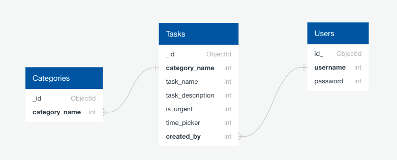

<a href="https://daily-planner101.herokuapp.com" target="_blank"></a>
# Daily Planner
### Third Milestone Project 

<p><strong>Daily Planner </strong> is a personal web application for those who loves to organize their daily plan, 
where users can register, log-in, create, read, update, delete and search created their plan</p>

<p>Inspired by my boyfriend who's very old school and who still write down his plan with the use of paper and pen. I find it difficult for me to 
see him still using the old fashioned way so I have decided to create an app with a simple, clean and user friendly design. 
For his love of the ocean, coffee, and croissant, I have used the said images to brighten up his day and every user and I guess everybody loves them too.</p>

[View the live project here](https://daily-planner101.herokuapp.com)
<hr>

### Table of contents
1. [UX](#UX)
     1. [Project Goals](#Project-Goals)
     2. [User Stories](#User-Stories)
     3. [Development Planes](#Development-Planes)
2. [Data Schema](#Data-Schema)
     1. [Users Collection](#Users-Collection)
     2. [Recipes Collection](#Recipes-Collection)
     3. [Categories Collection](#Categories-Collection)
3. [Features](#Features)
     1. [Design Features](#Design-Features) 
     2. [Existing Features](#Existing-Features)
     3. [Features to Implement in the future](#Features-to-Implement-in-the-future)
4. [Issues and Bugs](#Issues-and-Bugs)
5. [Technologies Used](#Technologies-Used)
     1. [Languages](#Languages)
     2. [Tools](#Tools)
     3. [Libraries](#Libraries)
     4. [Database Management](#Database-Management)
6. [Testing](#Testing) ☞ **[Testing.md](TESTING.md)**
7. [Deployment](#Deployment)
     1. [1. Database Creation](#1-Database-Creation)
     2. [2. Local Copy Creation](#2-Local-Copy-Creation)
     3. [3. Heroku App Creation](#3-Heroku-App-Creation)
8. [Credits](#Credits)
9. [Acknowledgements](#Acknowledgements)
10. [Technical Support](#Technical-Support)
***


***
# UX 
## Project Goals
The primary goal of **Daily Planner 101** is to provide a web-based application, that is simplistic and user friendly design, 
that allows users to **create**, **read**, **update**, **delete**, and **search** their plan in one app.

This is the third of Milestone Project that the developer student must complete during their Full Stack Web Development 
Program at The Code Institute and the main requirements is to build a full-stack website allowing users to manage a common dataset using 
**HTML5**, **CSS3**, **JavaScript**, **Python**, **Flask** and **MongoDB**.

#### User Goals
The user is looking for:
- A searchable database.
- Create a user account.
- An easy-to-use dataset management system with **CRUD** conventions to:

    - Create plan.
    - Read plan.
    - Update the plan.
    - Delete created plan.


#### Developer / Site Owner Goals
The Developer is looking to:

- Create a user-friendly application that they themselves would use for organizing their daily tasks .
- Demonstrate their proficiency in a variety of software development skills, using newly learned languages and libraries as well as a document database system.
- Deploy a project they are proud of, and excited to have, on their portfolio.


## User Stories
**As a General User, I want to:**

1. Create, Read, Update, Delete daily plan and find them on the database. 
2. View the selected plan dashboard to get necessary information.
3. Provide links to stay connected with the developer or an app made.

**As a Non-Registered User, I want to:**

1. Navigate to Sign-Up page to Register an account.

**As a Registered User, I want to:**

1. Log into my account to access to the full functionality of the planner.
2. Navigate to my planner page to view tasks.
3. Creat a task .
4. View my plans to edit task as needed.
5. View my plans to delete task.


**As an Admin, I want to:**

1. View Manage Plan button and should be to visible to admin.
2. Add categories, Edit and Delete them.


## Development Planes

***1. Strategy Plane*** 

The web app is being developed to be used as daily basis specially for organized. 
It is suitable for all gender and for all ages. It broken into three categories which focused on the following target audiences:
- **Roles:**
     - New Users (Non-Registered)
     - Returning Users (Registered)
     - Admin (Site Management)

The website needs to enable the user to:
- Register/Login to an account
- Create plan
- Search Plan created in the database 
- View created Plan with the following information:
    - Plan Category
    - Plan 
    - Plan Description
    - Plan Date
    - Time
    - Created by:

- Save and access their created plan
- Stay connected with the app through social links
- Button to go back to top
- Testimonials for user feedback


***2. Scope Plane*** 

A scope was defined to identify what needed to be done in order to align features with the strategy previously defined. This was broken into two categories:
- **Content Requirements**
     - The user will be looking for:
        - Creating an account:
            - Custom Username/Password
            - Create their own Plan
            - Manage their own Plan
        - Easy Navigation
        - Aesthetic and identifiable theme
        - My Plan dashboard
        - Searchable database system
        - Site Social links

- **Functionality Requirements**
     - The user will be able to:
        - Register/Login to account
        - Create their profile:
            - Customise Username/Password
            - Edit and Delete their account
            - Create their own Plan
            - Edit and delete their Plan
            - Save Plan
        - Navigate to their plan:
            - Search engine
            - My Plan Page
        - Create their plan, providing:
            - Plan Category
            - Plan 
            - Plan Description
            - Plan Date
            - Time
            - Created by:
        - Stay connected with site
            - Social links

***3. Structure Plane*** 

The information architecture was organized in order to ensure that users could navigate through the site with ease and efficiency, 
with the following results: 


**Information Architecture for User Management:**


***4. Skeleton Plane*** 

Wireframe mockups were created in a [Balsamiq Cloud](https://balsamiq.cloud/sw8ybdy/pnztp2i/r2278) with providing a positive user experience in mind:


***5. Surface Plane*** 

- <strong>Colour Scheme</strong>

     - The chosen colour scheme was specifically selected in order to define the tone of the application.

     - A colour palette was developed to create an ambient and familiar environment throughout the site.

     - "COLOORS" is being used for [Color Generator](https://coolors.co/).

     - The selected colours are:

          

     - Additional colors are simply green and red for the highlight buttons like "Done and Urgent buttons". 


- <strong>Typography</strong>

     - The primary font chosen is [Roboto](https://fonts.google.com/specimen/Roboto#standard-styles). Roboto has a dual nature. 
     It has a mechanical skeleton and the forms are largely geometric. At the same time, the font features friendly and open curves. 
     While some grotesks distort their letterforms to force a rigid rhythm, Roboto doesn’t compromise, allowing letters to be settled 
     into their natural width. This makes for a more natural reading rhythm more commonly found in humanist and serif types. 
     This is the stardard font type of "Materialize". I also made sure that it wont complicate throughout application.

- <strong>Imagery</strong>

     - The imagery chosen are from [Unsplash](https://unsplash.com/) in order to create a consistency of the app while maintaining the 
     look and feel of the application. 
     - I have used [Cloudinary](https://cloudinary.com/) and apply it to connect with the images used. I have input text as well on the 
     banner image in which the app would love to emphasize and the purpose of it is to motivate the user as well.
        -  by Amy Humphries
        -  by Cathryn Lavery

[Back to top ⇧]()

## Data Schema

For this project, the NoSQL database [MongoDB](https://www.mongodb.com/) was used to store the dataset. 
Within the created database, three collections were created, as illustrated below:



### Categories Collection

- There are three specified categories that the developer made for the user to chose from depending on 
the different times of the day:
    - Morning
    - Afternoon
    - Evening

### Tasks Collection
- When creating a recipe, the user provides:
    - Plan 
    - Plan Description
    - Plan Date
    - Time
    - Created by:

### Users Collection
- When registering an account, the user provides:
     - Username (unique identifier)
     - Password (hashed)

## Features

### Design Features
Each page of the website features a responsive and intuitive navigational system:
- There is a conventionally placed **navbar** on the top of each page with easily accessible navigation links with a clickable logo, redirecting users back to the home page.
    - On mobile and tablet screens, the navbar is located in a conventionally placed 'hamburger' menu.
- Landing Page Navbar includes:
    - Home
    - Log in
    - Register
- Upon Logging in Navbar includes: 
    - Home
    - My Plan
    - Add Plan
    - Log out
- If the admin is in session, there will be additional link added to the `navbar`:
     - Manage Plan
- On mobile and tablet screens, the extra buttons will appear on the navigation (hamburger) menu in order to provide quick access.
- There is a **banner image with quotes** on landing page.
- There is an **image** at the  bottom of the banner image to create eyecatching landing page.
- Testimonials of the user on the landing page.
- The **Footer** contains the appropriate **icons** to allow users to:
    - Link to the Facebook Page.
    - Link to the Instagram Page.
    - Link to the Pinterest Page.
    - Link to the Yoututbe Page.
- Copyrights on th footer.   
- Go to top button.
- [Jinja](https://pypi.org/project/Jinja2/) was used to extend the `base.html` page, allowing for the utmost consistency and preservation of functionality across all pages. 
    The extended block elements created basic layout for each page. Sample:

     ```
    
    Members

    
    
        <ul>
        
        <li><a href="{{ user.url }}">{{ user.username }}</a></li>
        
        </ul>

    

     ``` 


### Existing Features

**[Home Page](http://bake-it-til-you-make-it.herokuapp.com/home "Link to Home page")**
| Feature      | Description  |
|--------------|--------------|
| Carousel     | Bootstrap Carousel Component that displays the l**ast four uploaded** recipes |
| Call to Action | Buttons connecting users to **Sign Up** or **Login** pages, if **not signed in**, or **My Recipes** or **My Favourites** pages, if **signed in**|


**[My Plan Page](http://bake-it-til-you-make-it.herokuapp.com/find_recipes "Link to Find A Recipe page")**
| Feature       | Description  |
|---------------|--------------|
| Search Bar    | Search bar function allowing users to **search** for their preferred recipes. Using a text search will direct users to the `search.html` page, displaying results. From there, they can **search again** to return. |
| Dropdown Menu | Nested dropdown menu to **refine** the users search by either **Category** or **Level**|
| Pagination    | The **Pagination** functionality will be activated once the amount of recipes to be displayed is over `6`. This was to avoid overwhelming the user.|

**Search Results**
| Feature       | Description  |
|---------------|--------------|
| Call to Action | There is a **Search Again** button allowing users to reset the search. This is conditional. If there **is** results from their search, the button is placed at the bottom of the page, allowing the users to view their results first. If there is **not** any results, the button is placed at the top of the page for their convenience (above the recommendations).

**[Log in Page](http://bake-it-til-you-make-it.herokuapp.com/register "Link to Sign Up page")**
| Feature       | Description  |
|---------------|--------------|
| Input Fields    | The **input** fields allow users to enter their information. The user can enter a profile image if they wish, or a default image will be used in it's place.|
| Image Preview | On adding an image url to the `Profile Picture` field, the user can preview their image to ensure that the link is correct and it is the image they would like to use. |
| Password Authentication | The **password** field uses [Werkzeug](https://werkzeug.palletsprojects.com/en/2.0.x/ "Link to Werkzeug information") to hash the password on entry and **confirm password** is validated using **Javascript**. If the passwords do not match, a `disabled` class is added to the **Register** button, preventing a password error. |
| Call to Action | Once the input fields are completed as required, the user can click to **Register** or, if they already have an account, they can **Login**. |

**[Register Page](http://bake-it-til-you-make-it.herokuapp.com/login "Link to Login page")**
| Feature       | Description  |
|---------------|--------------|
| Input Fields    | The **input** fields allow users to enter their username. |
| Password Authentication | The **password** field uses [Werkzeug](https://werkzeug.palletsprojects.com/en/2.0.x/ "Link to Werkzeug information") to un-hash the password for login authentication|
| Call to Action | Once the input fields are completed as required, the user can click to **Login** or, if they do not already have an account, they can **Register**. |

**Add Plan Page** (This page requires login authentication)
| Feature       | Description  |
|---------------|--------------|
| Call to Action    | The User's **My Recipes** provides multiple actions the user can take: **Edit Profile**, **Create Profile**, link to **My Favourites** and the **logout** function. If they have no recipes in their repository, the user will be provided with addtional links to **get inspired** (search recipes) or **get creative** (create a recipe).|

**Manage Plan Page** (This page requires login authentication)
| Feature       | Description  |
|---------------|--------------|
| Call to Action    | The User's **My Favourites** provides multiple actions the user can take: **Edit Profile**, **Create Profile**, link to **My Recipes** and the **logout** function. |

**Edit Plan Page** (This page requires login authentication)
| Feature       | Description  |
|---------------|--------------|
| Input Fields | The user is able to edit their profile image as they see fit. Their current information is used as the **default** value for the fields |
| Image Preview | The `Profile Image` field allows the user to preview their current profile image. Changing the image url calls a `JavaScript` function, allowing the user to get real-time feedback as they change the image.|
| Call to Action | The user can choose to **Cancel** their actions or **Save** their new information. Both return the user to **My Recipes**. Another button directs the user to the **Account Settings** page for user to take further action. |


### Features to Implement in the future

- Pagination
- Google login 
- Lazy loading images 
- "Remember me" signup checkbox
- Edit user profiles
- User profiles Avatar 
- Page loading animation
- Third party search engine
- Admin console
- More categories
- Sort tasks by date
- Testimonial functionality
- Email verification

[Back to top ⇧](#table-of-contents)